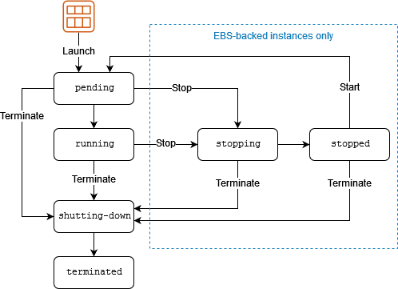

# AWS Certified Cloud Practioner (Topics)

## IAM: AWS Identity and Access Management

To access AWS services, you need to authenticate yourself through IAM. There are several ways to access IAM: 1) console (GUI), 2) using the AWS CLI, and 3) using APIs for automation. The user of IAM is called a principal. A principal may be an acutal person, a role, a federated user, or an application. 

In IAM, there is a root user and a non-root user. When you first sign up with AWS, you will login using the root account using your email address. The root user has full, unrestricted access to AWS services. However, it's a best practice to create an IAM user and login as this user. 

 There are 3 types of policies that can be attached to entities to control access to AWS.

 1. **Identity-based policies**: JSON documents attached to users, groups or roles that control what action they can perform. One form is an an inline policy, which can be applied to any of these but can't be re-used. Managed policies, which may either be AWS managed or customer managed, can be applied to multiple identities like users, groups or roles. 

 2. **Resource-based policies**: These are polices that are attached to resources  like S3 buckets. 
 
 3. **IAM permissions boundaries**: Another type of policy that sets the maximum permissions an identity-based policy can have.

 4. **AWS Organizations service control policies**: Specifies the maximum permissions for an organization.

5. **Session-based policies**: Mainly for APIs and are session based.

The IAM Policy Simulator is a tool to simulate IAM policies. The simulator is located at https://policysim.aws.amazon.com/home/index.jsp?#.

For a list of IAM best practices, see https://docs.aws.amazon.com/IAM/latest/UserGuide/best-practices.html.

If you want to apply permissions to a large number of users, the best practice is to create a group, add permissions to the group, and add users to the group. For example, if I'm in an account called "admins" and you want another person to be an admin, just add the user to that group.

## EC2: Amazon Elastic Compute Cloud

EC2 is one of the original and most important service on AWS. It's also used by many other services in AWS. An EC2 instance is a virtual machine. When you create an EC2 instance, you choose the memory, storage, networking and OS that you want to run in the cloud. AWS then creates the virtual machine for you, and then you're responsible for maintaining the OS. Storage is either Amazon EBS (persistent) or Intance Store (non-persistent). An AMI provides the information required to launch an instance.

### Connecting to EC2 instances

There are a few ways to connect to EC2 instances:

- Using SSH via a key pair (PEM)

- Using RDP (for Windows)

- Using the EC2 console (via EC2 Instance Connect)

- Using your own SSH key and SSH client

If there are any questions on the exam on how you would securely connect to an instance using SSH, choose "key pair".

### EC2 User Data

If you want your instance to run scripts on first boot, you can use User Data. 

### EC2 Metadata

Metadata about the instance is available at http://169.254.169.254/latest/meta-data. It provides information about your intance.

### Accessing services from within EC2 instances

By default, EC2 instances do not have the ability to connect to other AWS services. There are two ways to make this happen:

- Using access keys (which are associated with a user account). This is not secure as the credentials are stored in the EC2 instance and if compromised will expose your credentials.

- Using EC2 Instance profiles (which involves roles)

To use EC2 Instance profiles:

- Go to IAM, select Roles then create a Role with the AmazonS3ReadOnlyAccess policy

- Then go to EC2, select an instance, select Actions | Security and select Modify IAM Role, then choose the role we just created.

Afterwards, you should be able run aws commands from within the instance. For example: *aws s3 ls*.

Now that we've created a role, in the future we can specify this role at the time of EC2 instance creation.

### EC2 Status Checks & Monitoring

AWS will run status checks on each of your EC2 instances and report if any instances cannot be reached. 

AWS also monitors your EC2 instance and reports on metrics such as networking, CPU, memory and disk usage. These metrics come from Cloudwatch. You can go to the Cloudwatch service directly to see metrics for any service that you use. Metrics for EC2 instances are measured per hour. If you want to get even more detail, you can enable detailed metrics for a cost.

### Placement Groups

- Cluster: Instances are created wiithin an availabiltiy zone (possibly in the same rack). This is typically a requirement for HPC deployments. 

- Partition: Multiple instances are deployed to "partitions" or different racks in an availability zone to reduce the likelihood of instance failures. Typically used to deploy Hadoop, Cassandra, Kafka and NoSQL.

- Spread: Similar to Partition but each instance is placed on different hardware and is suitable for critical deployments. This type of deployment can span multiple Availability Zones in the same region.

See https://docs.aws.amazon.com/AWSEC2/latest/UserGuide/placement-groups.html. 


### Network Interfaces

There are two types of network interfaces: elastic network interfaces and elastic fabric adapters. The Elastic network interface is for general networking needs, while the Elastic Fabric Adapter is suited for HPC. If there are any questions on the exam asking if you should use an Elastic Network Interface (ENI) or an Elastic Fabric Adapter (EFA) for HPC, choose EFA.

When it comes to IP address, there are a few things to consider. Private IPs stay the same no matter the instance state. On the other hand, public IP addresses are dynamic and can change if the instance is stopped. Elastic IP addresses are public IP addresses that are static. They can be assigned to different instances and across availabilty zones. 

### Bastion Hosts

If an EC2 instance only has a private IP, you cannot SSH to it from the Internet. What you need to do is create a bastion host in a public subnet that also has a route to the private subnet. 

### NAT Gateways

If you deploy EC2 instances in a private subnet, you can deploy at NAT gateway so that the instance can connect to the Internet. It's important to remember that such gateways must be deployed to a public subnet. 

In the past, NAT instances were used to route traffic between private subnets and public subnets. These instances use a special AMI with the string "amzn-ami-vpc-nat" in the name. When deploying these AMIs, you need to disable source/destination checks.

NAT instances must be maintained just like any EC2 instance. NAT gateways, on the other hand, are managed by AWS. 

To create a NAT gateway, go to VPC | NAT gateways and create a NAT gateway. Remember that you must choose a public subnet. You must also create an elastic IP. Afterwards, you need to modify edit the route table used by the EC2 instance in the private subnet. Select the route, select Edit routes, and for destination select 0.0.0/0 and target is our NAT gateway. 

### EC2 Instance Lifecycle

EBS-backed intances have an additional instance state called "stopped". You are not stopped for stopped instances.



See https://docs.aws.amazon.com/AWSEC2/latest/UserGuide/ec2-instance-lifecycle.html.

### EC2 Pricing Options

- On-Demand: EC2 on-demand instances are used for dev/test, are short-term, or have unpredicatable workloads. They are charged the standard rate and have no discount. If there are any questions on the exam about needing short-term or unpredictable workloads, choose "on-demand".

- Reserved: By reserving intances for 1 or 3 years, you get up to a 75% discount. This is a good choice for steady-state, predicatable workloads.

- Spot instances: You get a discount of up to 90% for unused capacity; however, they can be terminated at any time.

- Dedicated instances: The EC2 instance is physically isolated at the host hardware level.

- Dedicated hosts: The physical server is dedicated for you. Ideal if you are using server-bound software licenses. If there are any questions about per-socket licensing, choose dedicated hosts.

### Architecture Patterns for EC2

- If your company needs to run a short batch script to configure EC2 Linux instance after they are launched, add the bash script to the user data of EC2 instances

- If you need a tightly coupled high performance computing (HPC) workload that requires low-latency between nodes and optimum network performance, you should launch EC2 instances in a single AZ in a cluster placement group and use an Elastic Fabric Adapter (EFA)

- If your LoB application receives weekly bursts of traffic and must scale for short periods, and you need the most cost-effective solution for this, use reserved instances for the minimum required workload and then use spot instances for the bursts in traffic.

- If you have an instance that needs a static public IP address, that needs to be remapped to another instance in case of instance failure, attach an elastic IP address to the EC2 instance. Ramap the address as needed.

- You have a fleet of Amazon EC2 instances that run in private subnets across mutlple AZs, then deploy a NAT gateway so that they can reach the Internet.

- If you have an application that uses several EC2 instances, and you want to eliminate the risk of correlated hardware failures, then launch the instances in a spread placement group.

- If your application requires enhanced network capabilities, choose an instance type supports enhanced networking and ensure the ENA module is installed and ENA support is enabled

- If your instance needs close to bare metal performance, EFA, and high performance networking, use an AWS nitro instance type.

### Elastic Load Balancer (ELB) and Auto Scaling

To scale the availability of your application, you need to know how to configure auto scaling and how to place an elastic load balancer to distribute traffic to your EC2 instances. 

Scaling up, otherwise known as vertical scaling, means to add or subtract system resources such as CPU, memory and disk. Scaling out, on the other hand, means to add or subtract EC2 instances.

EC2 auto scaling is able to scale in or scale out depending on metrics obtained from Cloudwatch logs indicating CPU usage or instance failure. Below are some key points:

- EC2 auto scaling launches and terminates instances dynamically.

- Scaling is horizontal (scales out)

- Provides elasticity and scalability

- Responds to EC2 status checks and CloudWatch metrics

- Can scale based on demand or on schedule

- Scaling policies define how to respond to changes in demand

- Auto Scaling groups define collections for EC2 instances that are scaled and managed together

Scaling Polices:

There are three scaling policies:

1. Simple scaling policy means that scaling relies on a metric from Cloudwatch as a basis for scaling. If CPU utilization exceeds a threshold of 80%, then you can create a policy to launch another EC2 intance. Useful when load is erratic. 

2. Target tracking: Adds or removes capacity as required to keep the metric at or close to the specific target value. For example, use this when You want to keep the CPU usage of your ASG at 50%

3. Step scaling means you can define mutliple actions based on the size of the alarm breach

### Architecture Patterns - Auto Scaling and ELB

- If you need high availability and elastic scalability for web servers, use EC2 Auto scaling and an application load balancer across multiple AZs

- If you need low latency connections over UDP to a pool of instances running a gaming application, use a network load balancer with a UDP listener

- If you need to whitelist static IP addresses for a highly available load balanced application in an AWS region, use a network load balancer and create static IP addresses in each AZ (you don't get a static IP address with an ALB)

- If you have an application in EC2 in an ASG that requires disaster recover across regions, you can create an ASG in a second region with the capacity set to 0. Take snapshots and copy them across regions.

- If you have an application on EC2 that must cale in larger increments if a big increase in traffic occurs, compared to small increases in traffic, you would create an ASG with a step scaling policy and configure a larger capacity increase. (Really?)

- If you need to scale EC2 instances behind an ALB based on the number of requests completed by each instance, you can configure a target tracking policy using the ALBRequestCountPerTarget metric

- If you have an application that runs on EC2 behind an ALB, and want to allow users to be able to connect to other EC2 instances without reauthenticating, you could use session state store such as DynamoDB or ElastiCache

- If a company is deploying an IDS/IPS system using virtual appliances and needs to scale horizontally, you could deploy a gateway load balancer in front of the virtual appliances

## AWS Organization and Control Tower

AWS Organizations is a service that allows us to create one organization from many AWS accounts. This service is then able to create an aggregate bill (called consolidated billing) and also allows us to manage multiple accounts.

Service control poliices (SCPs) are a type of organization policy that you can use to manage permissions in your organization. SCPs offer central control over the maximum available permissions for all accounts in your organization.

The FullAWSAccess SCP is an AWS managed policy which grants access to every operation.

An organizational unit (OU) is a logical grouping of accoutns in your organzation, created using AWS Organizations. OUs enable you to organize your accounts into a hierarcy and make it easier for you to apply management controls. AWS Organizations policies are what you use to apply such controls.

## Amazon Virtual Private Cloud (VPC)

### VPCs

A VPC or Virtual Private Cloud is a virtual network where resources are launched. A VPC is unique to each region. A default VPC is created for you in each region, but you can create your own VPCs. By default, you can create up to 5 VPCs. Public subnets are subnets that have a route table with an attached Internet Gateway, so that instances with a public IP can access the Internet. Each VPC has a CIDR block which defines a range of IPs.

Below are some VPC components:

- Subnet: A segment of a VPC's IP address range where you can place groups of isolated resources

- Internet Gateway: The Amazon VPC side of a connection to the public Internet. When you create a VPC, you should also consider whether to create an Internet Gateway so that the instance has access to the Internet. 

- NAT Gateway: A NAT service that allows your resources in a private subnet to access the Internet

- VPC Router: Routers connect subnets and direct traffic between Internet gateways, virtual private gateways, NAT gateways, and subnets

- Peering Connection: Routes traffic via private IPs between two VPCs

- VPC Endpoints: Enables private connectivity to services hosted in AWS

- Egress-only Internet Gateway: A stateful gateway that provides egress only traffic for ipv6 traffic

- Hardward VPC Connection: A hardware-based VPN connection between a VPC and a data center

- Virtual Private Gateway: The Amazon VPC side of a VPN connection

- Customer Gateway: Your side of a VPN connection

If you create your own VPC, you need to define a CIDR block that's big enough to define all the subnets for each AZ that you want to launch instances in. With the help of route tables, we can make some subnets private and others public. When we create our VPC, AWS will also create a route table that can be reached from the Internet, and it will implicitly associate our subnets with it. We can also make some subnets private by creating a route table that is not associated with an Internet gatway. We could also associate these subnets with a NAT gateway so that instances launched there can reach out to the Internet to download security updates, for example, but are protected from inbound traffic. CIDR block size can be between /16 and /28. The CIDR block cannot overlap with any other CIDR blocks in your VPC. 

### NAT Gateways

NAT Gateways must always be associated with a public subnet. When you create a NAT Gateway, you should also create an Elastic IP. Once the NAT Gateway has been created, it needs to be added to the route table for the private subnet. This allows EC2 instances in the private subnet to reach the Internet.

### Network ACLs

Security Groups and Network ACLs are two types of firewalls that can be applied to protect your EC2 instances. Network ACLs sit at the subnet level while a security group applies to an EC2 instance. Security Groups are stateful firewalls so they implicitly allow the return traffic. Network ACLs on the other hand are stateless so you need to specify both egress and ingress rules even if they use the same port. Network ACLs are processed in order, so if the first rule allows traffic, then no other rules will be processed. When modifying network ACLs, make sure the rules are created to cover your scenarios. Security groups support allow rules only while network ACLs support allow and deny rules

### VPC Endpoints

A VPC Interface Endpoint enables EC2 instances to connect to public services such as CloudFormation and CodeDeploy using a private IP address. If you want to connect the EC2 instances to S3 or DynamoDB without using a public IP, you can use a VPC Gateway Endpoint. A Gateway Endpoint uses a route table to acces these services.

### VPC Peering

VPC Peering is a networking connection btween two VPCs that enables you to routge traffic beetween the privately. The peering connection can be created between your own VPCs, with a VPC in another AWS account, or with a VPC in a different region. The CIDR blocks for each VPC must not overlap. 

When setting up VPC Peering, you need to ensure that each security group allows traffic from the other subnet. In addition, you need to set up the route table so that traffic to the subnet will go through the VPC Peering.

Note that you only need to set up VPC peering once per connection.

### VPC Transit Gateways

AWS Transit Gateway provides a hub and spoke design for connecting VPCs and on-premises networks as a fully managed service without requiring you to provision virtual appliances like the Cisco CSRs. No VPN overlay is required, and AWS manages high availability and scalability. 

Transit Gateway enables customers to connect thousands of VPCs. You can attach all your hybrid connectivity (VPN and Direct Connect connections) to a single Transit Gateway instance, consolidating and controlling your organization's entire AWS routing configuration in one place (refer to the figure under Transit VPC Solution). Transit Gateway controls how traffic is routed among all the connected spoke networks using route tables. This hub-and-spoke model simplifies management and reduces operational costs because VPCs only connect to the Transit Gateway instance to gain access to the connected networks. 

### Transit VPC 

Transit VPCs can solve some of the shortcomings of VPC peering by introducing a hub and spoke design for inter-VPC connectivity. In a transit VPC network, one central VPC (the hub VPC) connects with every other VPC (spoke VPC) through a VPN connection typically leveraging BGP over IPsec. The central VPC contains Amazon Elastic Compute Cloud (Amazon EC2) instances running software appliances that route incoming traffic to their destinations using the VPN overlay. Transit VPC peering has the following advantages: 


### AWS Private Link

AWS PrivateLink provides private connectivity between VPCs, AWS services, and your on-premises networks without exposing your traffic to the public internet. AWS PrivateLink makes it easy to connect services across different accounts and VPCs to significantly simplify your network architecture. This allows customers who may want to privately expose a service/application residing in one VPC (service provider) to other VPCs (consumer) within an AWS Region in a way that only consumer VPCs initiate connections to the service provider VPC. An example of this is the ability for your private applications to access service provider APIs.

### VPC Sharing

Sharing VPCs is useful when network isolation between teams does not need to be strictly managed by the VPC owner, but the account level users and permissions must be. With Shared VPC, multiple AWS accounts create their application resources (such as Amazon EC2 instances) in shared, centrally managed Amazon VPCs. In this model, the account that owns the VPC (owner) shares one or more subnets with other accounts (participants). After a subnet is shared, the participants can view, create, modify, and delete their application resources in the subnets shared with them. Participants cannot view, modify, or delete resources that belong to other participants or the VPC owner. Security between resources in shared VPCs is managed using security groups, network access control lists (NACLs), or through a firewall between the subnets.

### Private NAT Gateway

Teams often work independently and they might create a new VPC for a project, which may have overlapping classless inter-domain routing (CIDR) blocks. For integration, they might want to enable communication between networks with overlapping CIDRs, which is not achievable through features such as VPC peering and Transit Gateway. A private NAT gateway can help with this use case. Private NAT gateway uses a unique private IP address to perform network address translation for the overlapping source IP address, and a unique destination IP address that load balances the destination overlapping IP address. You can route traffic from your private NAT gateway to other VPCs or on-premises network using Transit Gateway or virtual private gateway.

## Amazon Simple Storage Service (S3)

S3 is an object-based storage system service. You can access objects in an S3 bucket using APIs. 
Files can be anywhere from 0 to 5TB. The objects that you can store in S3 include any file such as text files, MP4, JPEG, PDF or Word documents; it really doesn't matter. S3 has unlimited storage available. To access objects in an S3 bucket, you use a URL such as https://bucket.s3.aws-region.amazonws.com/key. S3 is a key-value storage system, and the key is the name of the file. Bucket names must be globally unique but buckets are created within a region. As a best practice, you should create buckets closest to the region where your services or users are located. S3 buckets can be replicated across regions but this needs to be confgured manually. S3 delivers strong read-after-write consistency. All the objects within an S3 buckets are at the same hierarcyh; however, you can created folders to simulate hierarcy. The keys of such objects have the folder name as a prefix. An object consists of:

- Key (name of the object)

- Version ID

- Value (actual data)

- Metadata

- Subresources

- ACL

EC2 instances in a public subnet can access S3 buckets via an Internet Gateway. EC2 instances in a private subnet can use an S3 Gateway Endpoint to access buckets using a private connection which uses a private IP address. 

By default, accounts are limited to 100 buckets. 

### S3 Storage Classes

See https://aws.amazon.com/s3/storage-classes/

### S3 Access Controls

Actions on S3 bucket objects are configured through IAM policies, S3 Bucket Policies, and ACLs. These policies are ANDed so that an IAM policy can be overridden by an S3 bucket policy and vice versa. For example, a user may be explicitly granted API access to a bucket through IAM policies, but the S3 bucket policy may deny these API actions. Morever, an S3 bucket policy may allow certain actions, but the IAM policy may deny them. ACLs are legacy access control mechanisms that predate IAM. 

### S3 Versioning

Versioning is a means of keeping multiple versions of objects within a bucket. Versioning enables you to retrieve old versions of objects in case of object deletion or overwrite.

### S3 Lifecycle Management

- Transition actions: Define when objects transition from one storage class to another

- Expiration actions: Define when objects expire (deleted by S3)

### S3 MFA

S3 MFA is a way to require MFA whenever an object is deleted.

### S3 Event Notification

You can configure S3 event notifcation by creating an SNS topic. 

### S3 Presigned URLs

If an object in an S3 bucket is not made publicly accessible, we can make it accessible using a presigned URL. The presigned URL has an item in it that indicates when it will expire.

To create a presign URL, run:

```
aws s3 presign s3://<bucket name>/<object name>  --profile <profile name>  
```

where profile name is in ~/.aws/config

### Multipart upload & transfer acceleration

Multipart upload is a way to break up large files into smaller pieces which can be uploaded in parallel and in any order. It is recommended for files greater than 100MB. It can be used for objects from 5MB up to 5 TB. It must be used for files larger than 5 GB. 

Transfer acceleration uses edge locations to improve upload speeds to an S3 bucket. 

### S3 Select and Glacier Select

S3 select and Glacier select are ways to retrieve files from buckets using an SQL-like expression. 

### Server access logging

S3 events can be logged to another bucket and can provide some auditing. 

### S3 Static Webistes

Static websites can be created using S3 by uploading files to an S3 bucket and then either applying ACLs or bucket policies (preferred) to allow users on the Internet to access files in the bucket.

### CORS

Cross-origin resource sharing (CORS) defines a way for client web applications that are loaded in one domain to interact with resources in a different domain. With CORS support, you can build rich client-side web applications with Amazon S3 and selectively allow cross-origin access to your Amazon S3 resources. 

### Cross-account S3 access

S3 buckets can be accessed by multiple accounts by creating a role with another account as a trusted entity. 

### S3 Object Lambda

With S3 Object Lambda, you can add your own code to S3 GET, HEAD, and LIST requests to modify and process data as it is returned to an application. 

## DNS, Caching and Performance Optimization

Amazon Route 53 is a DNS server. Amazon Cloudfront is a CDN, so it caches data in multiple global locations to improve response times for end users. AWS Global Accelerator is similar to Cloudfront but has different use cases. A hosted zone is a set of records belonging to a domain. 

When you use Cloudfront, you create a web distribution which has a DNS name. The distribution can have behaviors such as path pattern, viewer protocol, cache, and origin request. With any of these behaviors, you can direct users to different distributions depending on variables such as the origin, protocol being used, the TTL, and path. 

### Route 53 Hosted Zones

A **hosted zone** is a set of records belonging to a domain. Each record has a name like *example.com*, the type of record, the IP addresses, and TTL. 

### Route 53 Routing Policies

- Simple: Associates IP addresses with a DNS name. You can specify multiple IP addresses with a DNS name.

- Failover: Routes traffic from a primary IP to a secondary IP in case the primary is down

- Geolocation: Routes traffic to an IP closest to the requester

- Geoproximity: Rooutes traffic to the closest region within a geographic area. This policy uses a policy in Traffic Flow.

- Latency: Directs traffic based on latency

- Multivalue answer: Returns serveral IP addresses and functions as a basic load balancer

- Weighted: Directs traffic for a DNS name to an IP according to weighted values. 

- IP-based: directs traffic based onthe source IP

### Route 53 Migration

DNS records can be migrated from another DNS provider to Route 53. You can also migrate a hosted zone to another AWS account. You can also migrate from Route 53 to another registrar. You can also associate a Route 53 hosted zone with a VPC in another account. To do this:

- Authorize association with VPC in the second account
- Create an association in the second account

### AWS Global Accelerators

An AWS Global Accelerator is a service that allows you to route traffic to your applications using a the Global Accelerator network instead of the Internet. Global Accelerator provides *two* global static public IPs that act as a fixed entry point to your application endpoints. API workloads are acceleratored up to 60%. If one of the IPs fails, your client application can retry using the healthy static IP address. You can bring your own IP (BYOIP). 

See https://aws.amazon.com/blogs/networking-and-content-delivery/well-architecting-online-applications-with-cloudfront-and-aws-global-accelerator/ for a discussion about Cloudfront and Global Accelerator, and their differences at https://jayendrapatil.com/aws-cloudfront-vs-global-accelerator/. 

Both services reduce latency. A key difference is whether the solution improves latency via caching.

## Block and File Storage

Block storage systems are low-level storage similar to hard drives in a desktop computer. You can create volumes and partitions in block storage systems and mount them by a drive letter.

File-based storage systems such as NFS are available over the network. 

Object-based storage systems are very scalable and low cost. 

In AWS,

- EBS is block-storage

- EFS is file storage

- S3 is object storage

### EBS

EBS volumes are used by EC2 instances and must be created in the same AZ. They cannot be shared by other EC2 instances, and they cannot be accessed by EC2 instances in a different AZ. However, you can create a snapshot of the EBS volume and make that available to an EC2 instance in a different AZ. There is a new feature called EBS multi-attach which allows you to acces an EBS volume from multiple EC2 instances. EBS volumes do not need to be attached to an instance. The root EBS volume is deleted after the instance is terminated. Non-root EBS volumes are not deleted after the instance is terminated.

### AWS Data Lifecycle Manager (DLM)

You can use Amazon Data Lifecycle Manager to automate the creation, retention, and deletion of EBS snapshots and EBS-backed AMIs. When you automate snapshot and AMI management, it helps you to:

- Protect valuable data by enforcing a regular backup schedule.

- Create standardized AMIs that can be refreshed at regular intervals.

- Retain backups as required by auditors or internal compliance.

- Reduce storage costs by deleting outdated backups.

- Create disaster recovery backup policies that back up data to isolated Regions or accounts.

### EBS vs instance stores

- Instance store volumes are high performance local disks that are physically attached to the host computer on which an EC2 instance runs

- Instance stores are ephemeral which means the data is lost when powered off 

- Instance stores are ideal for temporary storage of information that changes frequently, such as buffers, caches or scratch data

- Instance store voume root devices are created from AMI templates storesd on S3

- Instance store volumes cannot be detached/reattached

### AMIs

An Amazon Machine Image (AMI) provides the information required to launch an instance

### EBS Snapshots

- Snapshots capture a point in time state of an instance

- Snapshots are an cheap way to backup data

- Snapshots can be used to migrate an EC2 instanc from one region to another

- If you have many snapshots, you can free up space in your account by removing older snasphots.

### Using RAID in AWS

- RAID is not provided by AWS as a service, so if you want to use RAID you need to configure it yourself

- RAID 0 and RAID 1 are potential options with EBS

- RAID 5 and RAID 6 are not recommended

### Amazon Elastic File System (EFS)

EFS is a file system that can be shared between many instances in multile AZ using NFS. 

### AWS DataSync

DataSync is a service that syncs existing file systems into EFS

### AWS Storage Gateway

AWS Storage Gatweway is a set of services that allow you to acces AWS services from on-prem resources. This includes:

- AWS S3 File Gateway: enables you to store and retrieve objects in Amazon Simple Storage Service (S3) using file protocols such as Network File System (NFS) and Server Message Block (SMB). Objects written through S3 File Gateway can be directly accessed in S3.

- FSx File Gateway: enables you to store and retrieve files in Amazon FSx for Windows File Server using the SMB protocol. Files written through Amazon FSx File Gateway are directly accessible in Amazon FSx for Windows File Server.

- Volume Gateway: provides block storage to your on-premises applications using iSCSI connectivity. Data on the volumes is stored in Amazon S3 and you can take point-in-time copies of volumes that are stored in AWS as Amazon EBS snapshots. You can also take copies of volumes and manage their retention using AWS Backup. You can restore EBS snapshots to a Volume Gateway volume or an EBS volume. There are two modes: 1. Stored volume mode, where data is stored in locally but but backed up to S3 as snapshots 2. Cached volume mode, where data is stored remotely but cached locally.

- Tape Gatewuay: provides your backup application with an iSCSI virtual tape library (VTL) interface, consisting of a virtual media changer, virtual tape drives, and virtual tapes. Virtual tapes are stored in Amazon S3 and can be archived to Amazon S3 Glacier or Amazon S3 Glacier Deep Archive.

## Docker Containers and ECS

Amazon ECS is the Amazon service that allows us to run containers in AWS. To run containers, you create a cluster.  The cluster can use AWS Fargate for serverless container management, Amazon EC2 instances where users need to manage EC2 instances, or external instances using EC2 Anywhere.

In a cluster, you can either either create tasks or services. The advantage of a service is that it provides auto-scaling via a Capacity Provider.

Amazon EKS is a managed servie for running Kubernetes applications in the cloud or on-premises. 

AWS App Runner is a fully managed application service that lets you build, deploy, and run web applications and API services without prior infrastructure or container experience.

## Serverless Applications

Serverless applications are applications that are deployed to the cloud where users do not have to manage the underlying server. Users simply need to upload their code to a service. AWS Labmda is one of the most important serverless services in AWS. It allows you to run code as serverless functions. Other services include notification and message busses. 

Serverless services are suitable for integration into an event-driven architecture. For example, a Lambda function may be triggered whenever a file is added to an S3 bucket. The function may process the file, put it in another S3 bucket, and send a message to an SNS queue. Another Lambda function may listen to the queue and insert a record into DynamoDB, which is another serverless service. In all these interactions, the user does not manage any servers. 

The benefits of serverless services are:

- No instances to manage
- No hardware to provision
- No need to manage operating systems
- No need to worry about capacity planning or availability
- Can be very cheap to use

Lambda functions have default execution time of 3 seconds and a maximum execution time of 15 minutes. If your code needs to run longer than 15 minutes, then you need to use EC2. If you invoke multiple Lambda functions, they will be non-blocking and executed concurrently up to the burst cuncurrency quota depending on the region. If you use Lambda functions that interact with other AWS services, make sure it has the right permissions. Lambda functions are triggered by an event source. For stream-based services, the event source is specified on the Lambda side. If you need to troubleshoot Lambda functions, use CloudWatch. Benefits of Lamdba include: no servers to manage, continuous scaling, millisecond billing, and integration with almost all other AWS services. 

Below are some additional serverless services and their use caess:

- Simple Queue Service is a messaging queue that helps you build distributed applications

- Simple Notification Service (SNS) is a notification service that can do things like send email notifications when a cloudwatch alarm is triggered. It provides topcics for high-throughput, push-based (as opposed to pull-based), many to many messaging. 

- Step Functions provide coordination of various serverless AWS services with a visual workflow.

- EventBridge is a serverless event bus and it's useful for building serverless distributed event-driven applications. 

- Simple Workflow Service is similar to Step Functions and suports the coordination of various processes or exeuction logic

- Amazon MQ is a message broker service for Apache MQ and Rabbit MQ 

- Amazon Kinesis enables you to collect data from data streams such as IoT devices for processing at a later time

There are two types of SQS Queues. A Standard Queue will have best effort ordering but have nearly unlimitted throughput. A FIFO Queue supports up to 300 messages per second and will be delvered in order. Stanard Queues may deliver a message more than once, while a FIFO Queue will not introduce duplication. If a message fails to be delivered, a copy of the message will be put into a Dead Letter Queue for later analysis. 

With SQL, you also chang configure polling to be long or short. Long Polling means that the polling will be delayed and eliminates empty response. Short polling happens very often and may not return all messages. Long polling can produce fewer API calls which can lower cost. 

## Databases and Analytics

Databases and Analytics come up a lot in AWS exams and include relational databases like RDS and Aurora and NoSQL databases like DynamoDB, data warehouses like RedShift and Elastic MapReduce, as well as services for streaming analytics like Amazon Kinesis, DataStreams and FireHose. 

### RDS

RDS is a managed relational database that runs on EC2 instances, so users need to specify the instance type. RDS supports a variety of database engines including AWS's Aurora, MySQL, MariaDB, etc. You can change the instance type to scale vertically. You can configure Multi-AZ as a passive standby in case the primary database goes down. You can also configure read-only replicas to reduce latency, but there is a delay in synchronizing data. Data can be encrypted at rest and in transit. 

RDS supports both automated and manual backups. For automated backups, there is a retention period of 0-35 days, or roughly one month. for each backup, and then it's gone. If you do manual backups, there is no retention period. 

Because RDS makes use of EC2 instances, you may need to take the instance offline for patching during what's called a maintenance window. 

A few key points about RDS:

- You cannot create an encypted read replica from an encrypted database or vice versa. The read replica will always have the same encryption settings as the primary database. 

- The same KMS key is used for databases and read replicas only if they are in the same region.

- Databases can only be encrypted if an encrypted snapshot is created from an unencrypted EBS volume. Once you create a database, you can't change the encryption, you have to create a snaphot, then create another snapshot from it that's encrpted, and then you can launch an encrypted version of the database.

-  Amazon Aurora is an AWS database offering in the RDS family

- An Amazon RDS Proxy increases scalability, fault-tolerance and security for an RDS database. It sits in front of an RDS database like Amazon Aurora and creates a pool of connections for clients including Lamda functions 

RDS works in many cases but there are some exceptions. For example:

- If you need to run an unsupported database or if you need access to the OS, create the database on EC2

- If you need lots of BLOBs, you can use S3

- If you need automated scaling, key-value pair databases, or unstructured databases, use DynamoDB instead

These are examples of RDS antipatterns.

### ElastiCache

Amazon ElastiCache is an in-memory key-value store database like Redis. It can be deployed to cache results from an RDS database. Since it runs on EC2, you do need ot specify the instance type at creation time. 

There are two basic flavors of ElastiCache: MemCached and Redis. With MemCached, data is not persistent, the data is simpler, does not support encryption, and is multi-threaded so it has higher performance. 

## Deployment and Management

## Monitoring, Logging and Auditing

## Security

## Migration and Transfer

## Web, Mobile, ML and Cost Management

## References

https://mxtoolbox.com/subnetcalculator.aspx?gclid=CjwKCAjw15eqBhBZEiwAbDomEjutOkUsY_q3ppcMBbhL9Y95-_pyNmsudjBVCvh-PGYtYK6VaBfGsxoCbhcQAvD_BwE
