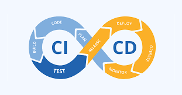
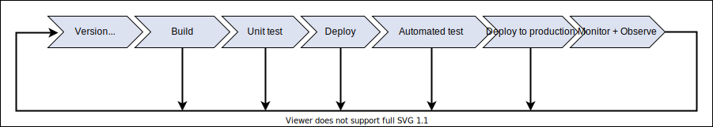

# Introduction

AWS provides a variety of services to support CI/CD. This includes:

- CodeCommit

- CodeBuild

- CodeDeploy

- CodePipeline

## CI/CD

CI/CD is a process to deploy software successfully. It can be envisioned as a continuous loop:



A CI/CD build pipeline ties various tasks together to ensure the build is a successful one. 



Some of the popular tools used to support each CI/CD are listed below.

- Continuous integration tools: Jenkins, Bamboo
    
- Dependency management tools: Nexus, Jfrog
    
- Configuration management tools:Ansible, Puppet, Chef

- Integrated development environments: Visual Studio Code, AWS Cloud9, Visual Studio, JetBrains IDEs

- Issue tracking tools: Jira, Azure Board
    
- Collaboration tools: Confluence

- Testing tools: AntUnit, Cucumber, JMeter, SoapUI, Selenium
    
- Version control systems: Git, SVN/Subversion, Perforce
    
- Build tools: Ant, Rake, Maven

With CI/CD, releases can occur frequently incoprorating features and bug fixes at a rapid rate. 


## CI/CD Tools on AWS

- CodeCommit is AWS's source control system that integrates with git repositories on AWS. Since it is an AWS service, it scales automatically, is secure, integrates with other AWS services, 

CodeBuild is AWS's build service. Builds are defined in a script file known as `buildspec.yml`.

CodeDeploy is AWS's deployment service. Similarly to CodeBuild, CodeDeploy scritps are written in `appspec.yml`.

CodePipeline is AWS's pipeline service. It is used in conjunction with CodeCommit and CodeDeploy.

CodeStar is a quicker way to get started with CI/CD.

CloudFormation is a tool to manage AWS resources using configuration files.

Cloud9 is an IDE.

## Using the AWS CLI to create and manange CodeCommit repositories

The AWS CLI can be used to create and manage CodeCommit repositories.

To create a repository:

```
aws codecommit create-repository --repository-name test --repository-description "test"
```

List all repositories

```
aws codecommit list-repositories
```

Delete a repository

```
aws codecommit delete-repository --repository-name test
```

Upload an empty file.

```
aws codecommit put-file --repository-name CICD_on_AWS --branch-name main --file-content file://helloWorld.txt --file-path /helloWorld.txt --name "Taro" --email "taro.foo.com
```

Get information about a branch

```
aws codecommit get-branch --repository-name CICD_on_AWS --branch-name main
```

List remote branches

```
aws codecommit  list-branches --repository-name CICD_on_AWS
```

Create a branch

```
aws codecommit create-branch --repository-name CICD_on_AWS --branch-name hotfix01 --commit-id <commit id>
```

Delete a remote branch

```
aws codecommit delete-branch --repository-name CICD_on_AWS --branch-name hotfix01
```

## Using git with CodeCommit

Edit ~/.gitconfig and add:

```
[credential]
	helper = !aws codecommit credential-helper $@
	UseHttpPath = true
    cache = 86400

```

Verify:

```
git config --global -l
```

Get the repostiory URL

```
aws codecommit get-repository --repository-name CICD_on_AWS
```

Clone the repository

```
git clone <cloneUrlHttp>
```

## CodeBuild

How to create a a build project using CLI

```
aws codebuild create-project --region us-east-1 --generate-cli-skeleton > file.json
```

## Questions

- Q: Which statement best explains the difference between continuous delivery and continuous development? A: Continuous delivery ensures that a decision is made before code is pushed to end-users, while continuous deployment ensures every change that is made is automatically deployed to production.

- Q: Which of the following is not a configuration management tool?
 A: CodeCommit
 
# References

https://www.educative.io/courses/ci-cd-using-native-tools-available-on-aws