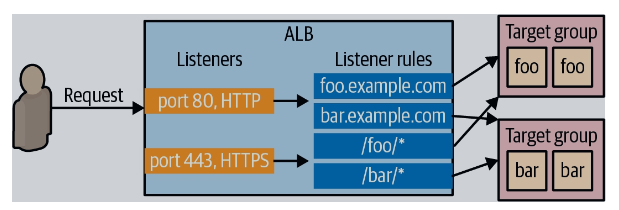

# Part 2: Creating an EC2 instance

## Singleserver Example

We start with a simple example that creates an EC2 instance using an AMI. The AMI is for Ubuntu Server 22.04 LTS. 

First cd to the helloworld example.

```sh
cd files/single_server
```

If you write teraform files by hand, run terraform fmt to format the file.

```sh
terraform fmt
```

Next, run terraform init. 

```sh
terraform init
```

Next, run terraform apply. You'll be prompted to approve the changes.

```sh
terraform apply
```

Note that AMI IDs are unique to AWS regions. If you get an error saying that the AMI could not be found, validate that the AMI ID exists in the region you want to use.

You can validate the result by logging into the AWS console and going to the EC2 dashboard. Alternatively, run terraform show to see the same values.

Finally, let's destroy the instance. This will terminiate the instance but it may take some time for the instance to be removed.

```sh
terraform destroy
```

## Single server 2 example

This next example adds a data section to look up the latest Ubuntu AMI available. Note that in order to run this example, you need to subscribe to Ubuntu 22.04 LTS - Jammy in the AWS Marketplace.

```sh
cd files/single_server2
terraform init
terrform apply
```

See https://aws.amazon.com/premiumsupport/knowledge-center/cancel-marketplace-subscription/ for steps on how to unsubscribe to the subscription.


## hello_local example

This example writes a file with some content using the local_file resource.

Before we run terraform apply, you can run terraform plan to preview changes. 

If you want to now apply changes without prompting, run:

```sh
cd hello_local
terraform apply -auto-approve
```

If you make a change to the file and run terraform apply again, the file contents will be restored. This is an example of configuration drift and state machine.

However, rather than running terraform apply every time, it is best to run terraform refresh. This allows terraform to reconcile changes made remotely (in this case, in the file) with the .tfstate file. 

## My IP

The **my_ip** example is a variation of the **hello_local** example and prints your public IP.

## Deploying a single web server

The **single_web_server** example deploys a web server on an EC2 instance. The *user_data_replace_on_change* flag is set to true so that if the user data changes in the terraform file, Terraform will terminate the original instance and launch an new one.

To test this example, after deployment run:

```sh
curl http://<public ip>:8080
```
## Auto Scaling groups

In AWS, you can deploy a cluster of servers in what's called an Auto Scaling Group (ASG); this prevents a single point of failure in a production environment.

The code for this example is at `files/asg`. It deploys a pair of EC2 instances. Each server can be access at http://<public.ip>:8080. The public IP is displayed in the EC2 console.

To understand how to create an ASG, it helps to create it using the AWS console. If you login to the AWS console and sleect EC2, you'll find Auto Scaling Groups at the bottom. If you select it and click `Create Auto Scaling group` you'll be taken to a wizard to create an ASG. In the process, you're required to define a launch template, which is similar to the form for creating an EC2 instance. 

Note that while some texts may explain how to define a launch configuration for use with an ASG, these are deprecated and you should use launch templates instead.

I recommend looking at the official docs like https://registry.terraform.io/providers/hashicorp/aws/latest/docs/resources/autoscaling_group and https://registry.terraform.io/providers/hashicorp/aws/latest/docs/resources/launch_template when creating an ASG.

## Deploying a Load Balancer

A load balancer can balance the traffic between EC2 instances deployed by an ASG. An ALB consists of listeners, listener rules, and target groups. 



The listener rule ties the listener with the target group. 

the `alb` example illustrates load balancing by deploying the web app and displaying the IP of the EC2 instance it is running on. This is a very complicated example that really illustrates how Terraform can be used to deploy pure web applications.

## References

https://livebook.manning.com/book/terraform-in-action

https://developer.hashicorp.com/terraform/cli/commands/graph

https://github.com/brikis98/terraform-up-and-running-code/blob/master/code/terraform/02-intro-to-terraform-syntax/webserver-cluster/variables.tf

https://github.com/brikis98/terraform-up-and-running-code.git